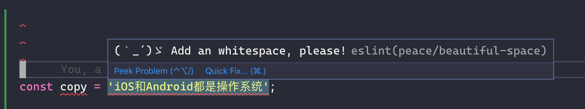

# eslint-plugin-peace

some rules in bytedance devops group

## Installation

Install `eslint-plugin-peace`:

```
$ yarn add -D eslint-plugin-peace
```

**Note:** If you installed ESLint globally (using the `-g` flag) then you must also install `eslint-plugin-peace` globally.

## Usage

Add `devops` to the plugins section of your `.eslintrc` configuration file. You can omit the `eslint-plugin-` prefix:

```json
{
  "plugins": ["peace"]
}
```

Then configure the rules you want to use under the rules section.

```json
{
  "plugins": ["peace"],
  "extends": ["plugin:peace/recommended"],
  "rules": {
    "peace/beautiful-space": 2
  }
}
```

## Supported Rules

### beautiful-space (**Recommended**)

用来在中英文之间插入空格。比如 `iOS和Android是两个操作系统` 会自动修复成 `iOS 和 Android 是两个操作系统`



- [x] 在中文和英文字母，中文和数字之间插入空格
- [x] 支持检测模板字符串
- [ ] 标点符号和文字之间插入空格

NOTE：目前模板字符串只会检测 `${foo}` 是 Identifier 或者 Literal 的场景，如果是其他复杂表达式，暂时不支持。显然这种方式也可以覆盖绝大多数场景了
